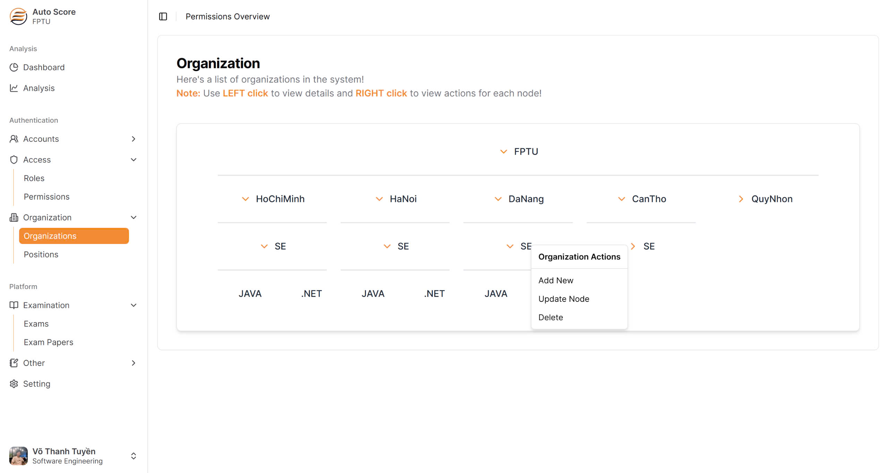

# AutoScore

### 🚀 Automatic Grading Tool for Structured API-based Subjects at FPT University

---

## 📌 Project Information

- **Project Name:** AutoScore  
- **Topic:** Automatic grading tool for subjects using structured API at FPT University.  
- **Team Name:** CodeEval Crew  

---

## 👥 Team Members

- **SE160607** - Võ Thanh Tuyền  
- **SE160611** - Thiều Phan Văn Minh  
- **SE160599** - Võ Trọng Vương  
- **SE160585** - Hà Nhật Trường  

---

## 🎓 Supervisor

- **Nguyễn Văn Chiến**

---

## 📖 Overview

AutoScore is an AI-powered tool designed for automatic grading of subjects using structured APIs at FPT University. It employs AI to generate test cases, streamlining the grading process with high speed, accuracy, transparency, and cost-effectiveness. The system is integrated with multiple services to enhance efficiency and reliability.

---

## 🛠️ Technology Stack

- **Frontend:** ReactJS, Typescript, Tailwind CSS, Shadcn UI  
- **Deployment:** Google Cloud App Engine  
- **Other Tools:** GitHub  

---

## 🔥 Screenshots

- 🔐 Authentication & Authorization
  

- 👤 Account Management  
  
  
  
  
- 🎭 Role & Permission Management
  
  
  
  

- 🏢 Organization & Position Management
  
  
  
- 📄 Exam & Exam Paper Management
  
  
  
  
  
  
  
  
  
  
  
  
  
- 📥 Import Source Code & Student Data
  
  
  
  
- 📚 Subject & Semester Management
  
  
  
  
  
- 📊 Score Management & Grading Process  
  
  
  
---

## 🙏 Acknowledgements

Special thanks to **Nguyễn Văn Chiến**, our project supervisor, for his invaluable guidance and support.

---

